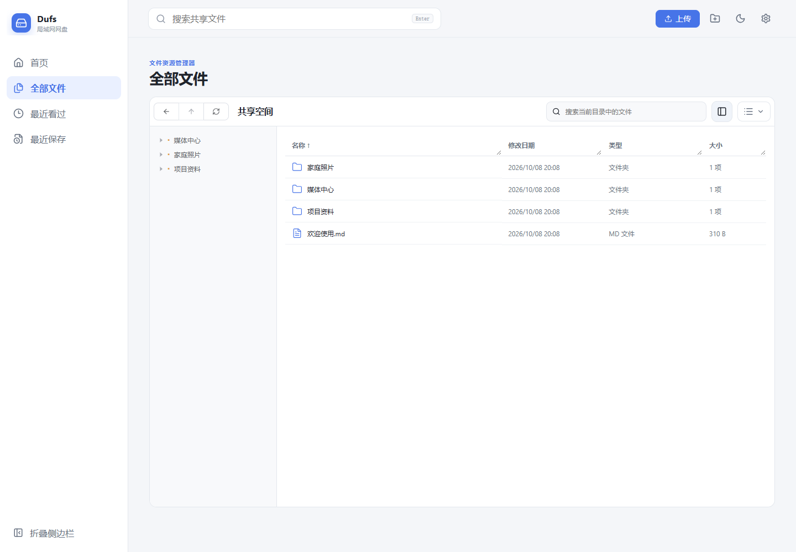
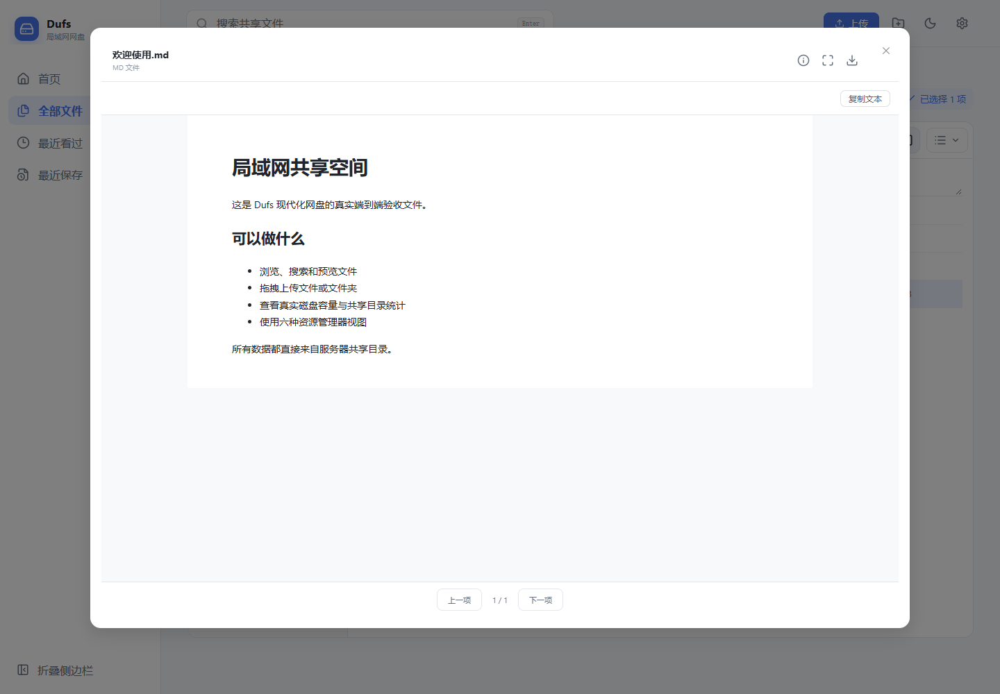
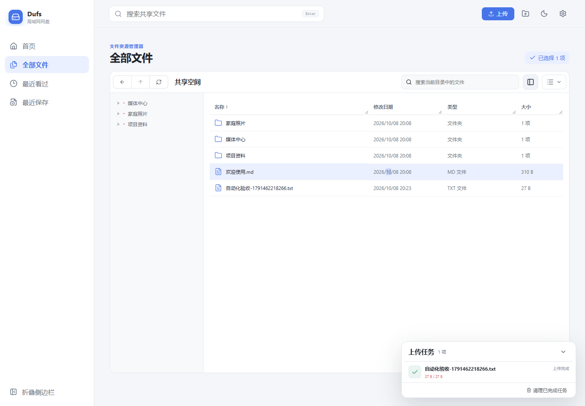
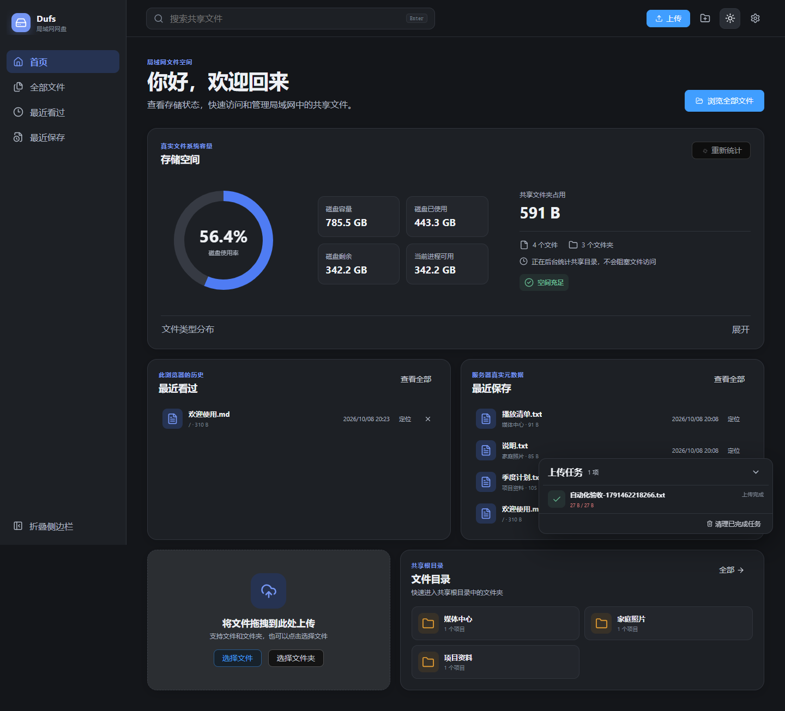

# Dufs 现代化局域网网盘

基于 Dufs 0.46.0 的现代化局域网文件管理系统。它保留 Rust 文件服务器、WebDAV、Range、断点续传、权限控制和单文件部署能力，并提供简体中文的 Windows 11 风格网页文件管理器。

适用于个人电脑、家庭 NAS、实验室服务器和可信局域网文件共享。服务端不需要数据库、Redis、Java 或 Node.js 运行时；Node.js 只参与前端构建。


## 主要功能

- 现代化首页：真实磁盘总容量、已使用、剩余、进程可用空间和共享目录占用。
- 后台目录统计：文件数、文件夹数、最近保存及图片/视频/音频/文档/压缩包/其他六类容量。
- 六种资源管理器视图：超大图标、大图标、中等图标、小图标、列表、详细信息。
- 文件操作：浏览、搜索、多选、右键菜单、上传、新建文件夹、下载、目录 ZIP、复制链接；服务器开放权限后可重命名和删除。
- 上传管理：真实进度、速度、剩余时间、并发队列、取消、失败重试、断点续传和同名冲突处理。
- 文件预览：图片、PDF、浏览器兼容音视频、文本、Markdown、JSON、常见代码、DOCX 和 XLSX 基础预览。
- 本地历史：最近看过使用 IndexedDB，仅保存在当前浏览器；最近保存来自服务器真实文件元数据。
- 浅色、深色和跟随系统主题；桌面优先并支持平板、手机基础操作。
- 自定义 assets、HTTPS、访问控制、WebDAV、CORS、日志和路径前缀继续兼容。

## 界面预览

| 文件详细信息 | Markdown 预览 |
|---|---|
|  |  |

| 上传任务 | 深色主题 |
|---|---|
|  |  |

截图由 Playwright 在真实 Rust 服务上生成，不是静态设计稿。

## 默认权限与安全边界

本分支面向可信局域网，默认匿名允许：

- 浏览、搜索和预览；
- 上传新文件和文件夹；
- 下载文件和目录 ZIP。

默认禁止：

- 删除文件；
- 覆盖同名文件；
- 在线修改文件内容；
- 越过共享根目录或跟随外部符号链接。

`--allow-delete` 与默认上传能力组合后会允许覆盖、移动和删除，请谨慎使用。只读部署可增加 `--no-upload`；还可通过 `--no-search`、`--no-archive` 关闭对应功能。

> 默认监听所有可用网卡。匿名上传只适合可信局域网，切勿把默认配置直接暴露到公网。公网部署至少应配置 HTTPS、Dufs 路径权限或受控的反向代理。

## 快速开始

### Windows

```powershell
# 共享已有目录，默认端口 5000
.\dufs.exe "D:\SharedFiles"

# 显式指定局域网监听地址和端口
.\dufs.exe "D:\SharedFiles" -b 0.0.0.0 -p 5000

# 只读（仍可浏览、搜索、预览和下载目录 ZIP）
.\dufs.exe "D:\SharedFiles" --no-upload

# 使用示例配置
.\dufs.exe --config .\config.example.yaml
```

也可以使用启动脚本：

```powershell
.\scripts\start-windows.ps1 -SharePath "D:\SharedFiles" -Port 5000
```

在 Windows 防火墙允许 TCP 5000 后，其他局域网设备访问 `http://服务器局域网IP:5000`。

### 浏览器兼容性

- 推荐 Chrome / Edge 88+、Firefox 78+ 或 Safari 14+；前端生产代码按 ES2020 构建。
- 支持通过普通 `http://局域网IP:端口` 浏览、上传和复制。上传任务 ID 不依赖 `crypto.randomUUID`；剪贴板 API 缺失、被浏览器策略关闭或权限被拒绝时，会自动使用安全的纯文本复制降级。
- 自动复制最终仍可能被浏览器或企业策略完全禁止，此时界面会明确提示手动复制。公网部署仍应使用 HTTPS；兼容降级不会替代认证和传输加密。
- 音视频编解码、全屏和文件预览能力取决于浏览器。功能代码对受限 Web API 做能力检测，不以浏览器版本推断能力。

### Linux

```bash
./dufs /srv/shared -b 0.0.0.0 -p 5000
# 或
./scripts/start-linux.sh /srv/shared 5000 0.0.0.0
```

## 开发与构建

### 环境

- Rust stable；
- Node.js 22 或更高版本；
- Windows：Visual Studio 2022 C++ Build Tools 和 Windows SDK；
- Linux：系统 C/C++ 编译工具链。

### 前端

```bash
cd web
npm ci
npm test
npm run build
```

生产资源输出到根目录 `assets/`。入口 HTML 使用 `__ASSETS_PREFIX__` 和 `__INDEX_DATA__` 占位符；JavaScript 分块相对于主脚本加载，因此同时支持根路径和 `--path-prefix`。

### Rust

```bash
cargo test --all
cargo build --locked --release
```

Windows 一键构建：

```powershell
.\scripts\build.ps1
```

Linux/macOS 一键构建：

```bash
./scripts/build.sh
```

最终产物为 `target/release/dufs.exe` 或 `target/release/dufs`。Vue、PDF worker、图标、样式等生产资源由 `include_dir` 编译进该文件，运行时不依赖 CDN 或 Node.js。

## 存储空间统计

`GET /__dufs__/storage` 返回：

- 共享目录所在文件系统的总容量、空闲容量和当前进程可用容量；
- 磁盘已使用容量，严格按 `总容量 - 空闲容量` 计算；
- 共享根目录逻辑大小、文件数、文件夹数；
- 六类文件容量分布和最近修改文件；
- `idle`、`scanning`、`ready`、`error` 统计状态。

磁盘容量是轻量查询；共享目录统计在后台阻塞线程执行并缓存五分钟。上传、删除、移动等文件操作会把缓存标记为待刷新。手动重新统计有十秒限频；扫描不跟随符号链接、不越过共享根目录，并遵循隐藏规则。

接口不会返回绝对路径、系统用户名或其他磁盘目录列表。

## 文件视图和预览

视图、排序、主题、缩略图、自动刷新和扩展名偏好保存在浏览器本地。图片列表请求 `?thumbnail=<尺寸>`，服务端在 100 MB 源文件上限内生成 WebP 缩略图，避免列表直接下载全部原图。

PDF.js、Office 和代码高亮组件均按需加载。文本预览最多读取前 2 MB；DOCX/XLSX 浏览器预览上限为 25 MB。SVG 不作为图片直接执行，不支持的格式会明确提供下载入口。

Office 预览定位为“基础只读预览”，复杂排版、公式、宏、嵌入对象和旧版二进制 `.doc`/`.xls` 可能无法完整还原，应下载后使用桌面应用打开。

## 上传、下载与外部文件变更

- 新文件通过 Dufs PUT 直接写入共享目录；大文件失败后使用原生 PATCH + `X-Update-Range: append` 恢复。
- 同名文件先通过 HEAD 检查，用户可选择跳过、保留两者，或在服务器允许删除时覆盖。
- 下载沿用浏览器原生流式下载，不显示虚假进度，也不会把大文件完整读入前端内存。
- 目录 ZIP 使用 Dufs 流式归档。
- 页面刷新会重新读取真实目录；外部程序新增、删除或修改文件后即可看到变化。最近保存和共享容量支持手动重算及低频缓存刷新。

## 自定义界面资源

原版机制继续可用：

```bash
dufs /srv/shared --assets ./my-assets
```

目录必须包含 `index.html`，可使用：

- `__INDEX_DATA__`：Base64 编码的当前目录数据；
- `__ASSETS_PREFIX__`：静态资源 URL 前缀。

如使用本项目 Vue 前端作为外置 assets，请把完整 `assets/` 构建输出一起复制，不能只复制入口 HTML。

## 与原版 Dufs 的兼容性和迁移

保留原有文件 URL、WebDAV 方法、Range、断点上传、目录 ZIP、路径前缀、TLS、认证、隐藏路径和日志参数。主要行为差异是现代局域网模式默认打开上传、搜索和目录归档；需要原版只读上传策略时增加 `--no-upload`。

```bash
# 原版只读行为迁移
dufs /data --no-upload
```

已有 `--config` YAML 可继续使用，并可显式写入 `allow-upload: false`。

## 测试

```bash
# 前端单元测试
cd web && npm test

# 需要已启动测试服务的 Edge 端到端测试
DUFS_E2E_URL=http://127.0.0.1:5099 npm run test:e2e

# 发布前兼容性测试应使用真实局域网 IP，避免 localhost 的可信来源特例
DUFS_E2E_URL=http://192.168.31.13:5099 npm run test:e2e

# Rust 全量测试和静态检查
cargo test --all
cargo clippy --all --all-targets -- -D warnings
```

浏览器测试覆盖真实容量、目录读取、详细视图、Markdown 预览、真实上传和深色主题，并把截图写入 `docs/screenshots/`。兼容性用例会在页面初始化前禁用 `crypto.randomUUID` 和 Clipboard API，验证普通 HTTP 下的上传、复制链接、复制文本以及无未处理页面异常。

## 已知限制

- 浏览器只播放自身支持的音视频编码，不包含转码服务。
- PDF.js worker 较大，但仅在打开 PDF 时加载。
- 最近看过按浏览器独立保存，不在设备间同步。
- 最近保存依赖后台扫描缓存，不承诺毫秒级文件系统监听。
- 当前版本尚未引入行虚拟化；单目录达到数万项时建议使用搜索或拆分目录。
- 网络共享和特殊文件系统可能不支持完整容量信息，此时界面会显示“不可用”，不会伪装为 0%。

## 许可证

项目采用 MIT 或 Apache-2.0 双许可证。第三方依赖见 [THIRD_PARTY_LICENSES.md](THIRD_PARTY_LICENSES.md)。
